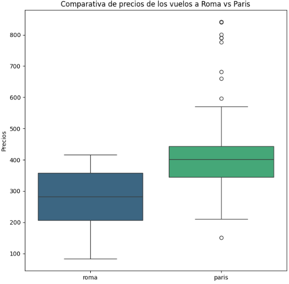
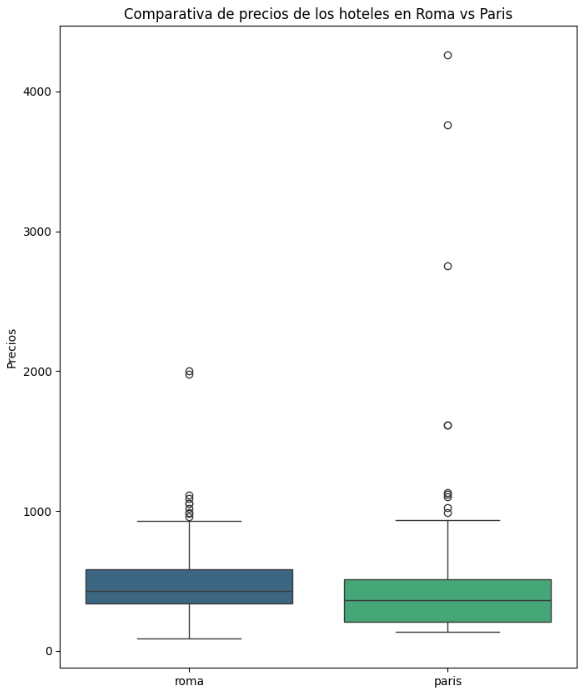
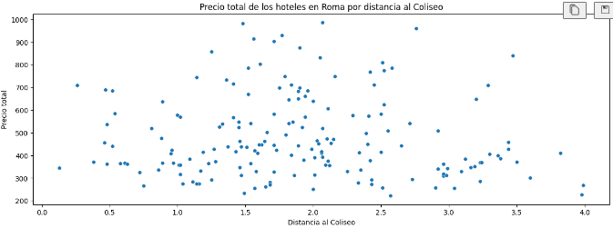
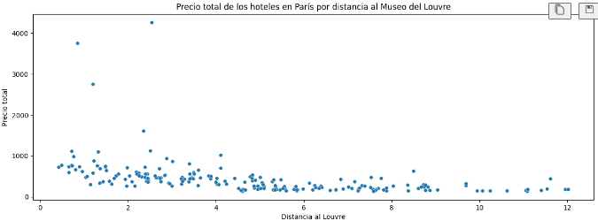

# Explorando Viajes con APIs y Web Scraping: Paris vs Roma


En este proyecto representamos a una agencia de viajes que recaba información para diseñar viajes personalizados. En esta ocasión nuestro cliente nos ha comunicado que viajará en solitario y lo hará durante el puente de diciembre, del 6 al 8 de diciembre de 2024. Sus dos destinos estrella son París y Roma, por lo que nos ha pedido que para ambos destinos le ofrezcamos una variedad de vuelos, hoteles y actividades y un cierto análisis de cuál sería mejor elegir.


## Objetivos del Proyecto

Los objetivos principales del análisis son:

1. **Recolección de datos**: 

    - Vuelos: Buscar información sobre frecuencia de vuelos, horarios y precios.

    -  Alojamientos: Recopilar datos de hoteles, hostales o pisos turísticos, incluyendo precios, servicios y tamaños de habitaciones.

    - Actividades: Encontrar actividades locales, como excursiones, turismo gastronómico, o deportes de aventura.

2. **Limpieza de datos**: Hacer uso de Pandas para limpiar los datos obtenidos para poder realizar un análisis detallado.

3. **Análisis Exploratorio de Datos (EDA)**: Realizar un análisis exploratorio de los datos para obtener conclusiones sobre los destinos y las opciones que mejor se ajustan a las necesidades de nuestro cliente.


## Resumen del proyecto

- Para la recolección de los datos se ha hecho uso de dos APIs: `sky-scrapper` para los vuelos y `booking-com` para los hoteles. Para obtener información sobre distintas actividades se ha realizado un scraping a la web de `https://www.guias.travel/tour/`. Todos los datos obtenidos se encuentran en la carpeta datos pero también se pueden recabar de nuevo ejecutando los tres archivos `.py` de la carpeta `src`.

- Para cada sección del viaje: vuelos, hoteles, actividades, se ha creado un dataframe partiendo de los datos recopilados y extrayendo únicamente la información deseada. Estos dataframes se pueden encontrar en la carpeta datos o pueden ser generados al ejecutar los archivos de la carpeta `src`.

- Una vez tenemos todos los dataframes de vuelos, hoteles y actividades para París y Roma se realiza una limpieza y a continuación se lleva a cabo el EDA. El análisis de datos se puede encontrar dentro de la carpeta `notebooks`.


## Conclusiones 

1. **Vuelos**: En los vuelos a Roma la media del precio de ida y vuelta es de 274 euros, bastante cerca de la mediana con 281 euros. Los precios de los vuelos van desde 80 hasta 415 euros. En el caso de París la media de los precios de los trayectos ida y vuelta es de casi 420 euros, cifra bastante más elevada que para Roma, y los precios de los vuelos van desde 150 hasta los 841 euros. Podemos observarlo de maner más gráfica:




Observando el top 5 vuelos más baratos para cada ciudad los de roma oscilan entre 82 y 105 euros mientras que para París van desde 150 hasta 253, por lo que se puede concluir que a nivel económico la mejor opción en cuanto a vuelos sería Roma. Luego pueden entrar a considerarse otros factores como las horas de salida de los vuelos o la comapñía de la aerolínea, si se desea más información en cuanto a los vuelos puede consultar el archivo `1-EDA.ipynb` en la carpeta de `notebooks`.

2. **Hoteles**: En Roma la media de puntuación de los hoteles obtenidos es de 8.6, practicamente igual a la mediana. El precio total por las dos noches del fin de semana es de 496 euros un poco por encima de la mediana que es 425, lo que nos indica que hay algún hotel bastante caro, siendo el precio máximo de 2000 euros y el mínimo unos 90. En cuanto a la distancia a nuestro punto de referencia que es el coliseo, la media está a unos 2km. Para París tenemos una puntuación media en los hoteles de 8.2. El precio medio para las dos noches en París es de 450 euros, bastante por encima de la mediana que son 361. De nuevo esto indica que hay valores muy altos como podemos corroborar viendo que el precio máximo es de 4260 mientras que el mínimo es de 135. Finalmente, al punto de referencia que es el Louvre están todos de media a unos 4.75km, lo cual es bastante, pero cuanto más nos acerquemos al centro más subirán los precios. Podemos ver estos datos de una manera más gráfica oservando la siguiente imagen:


También se lleva a cabo un estudio por puntuación y distancia a los puntos de referencia en el notebook anteriormente mencionado. Como la ubicación del hotel respecto a lugares emblemáticos de la ciudad es una de las principales características para elegir un hotel hemos realizado dos gráficas comparando ubicación y precio cuyas explicaciones se pueden encontrar en el EDA.




## Estructura del Proyecto

El proyecto está organizado de la siguiente manera:

- **datos/**: Carpeta que contiene los archivos `.json` obtenidos a través de las APIs, los archivos `html` obtenidos del scraping y los dataframes creados con los datos relevantes.

- **notebooks/**: Carpeta que contiene los archivos `.ipynb` sobre los cuales hemos trabajado los datos:
  - `0-hoteles.ipynb`
  - `0-scrapeo_actividades.ipynb`
  - `0-vuelos.ipynb`
  - `1-EDA.ipynb`
 
  Los tres primeros archivos son primeros bocetos de las funciones que posteriormente se han pasado a limpio y se encuentran en los archivos de la carpeta `src`. Las comparativas para cada sección del viaje y conclusiones se encuentran en el notebook de EDA.

- **src/**: Carpeta que contiene los archivos `.py` usados para hacer las llamadas a las APIs y el scraping y llevar a cabo la creación de los dataframes con la información relevante.
  - `api_hoteles.py`
  - `api_vuelos.py`
  - `scraping_actividades.py`


## Instalación y Requisitos
Este proyecto usa Python 3.11 y requiere las siguientes bibliotecas:
- [numpy](https://numpy.org/doc/stable/)
- [pandas](https://pandas.pydata.org/docs/reference/frame.html)
- [matplotlib.pyplot](https://matplotlib.org/3.5.3/api/_as_gen/matplotlib.pyplot.html)
- [seaborn](https://seaborn.pydata.org/)
- [dotenv](https://pypi.org/project/python-dotenv/)
- [requests](https://requests.readthedocs.io/en/latest/)
- [geopy](https://geopy.readthedocs.io/en/stable/)
- [BeautifulSoup](https://pypi.org/project/beautifulsoup4/)
- [Selenium](https://www.selenium.dev/documentation/)


Para visualizar el proyecto en tu máquina local, sigue estos pasos:

1. **Clona el repositorio**:
   ```bash
   git clone [URL del repositorio]
   
2. **Navega a la carpeta del proyecto**:
   ```bash
   cd Proyecto3-Explorando-Viajes

2. **Ejecutar o visualizar los archivos**:
   Podrás acceder a la carpeta `src` y ejecutar cada archivo indistintamente escribiendo: 
   ```bash
   pyhton [nombre_archivo]
   ```

   O también puedes acceder a la carpeta notebooks/1-EDA.ipynb y visualizar las gráficas y el análisis sobre los destinos.